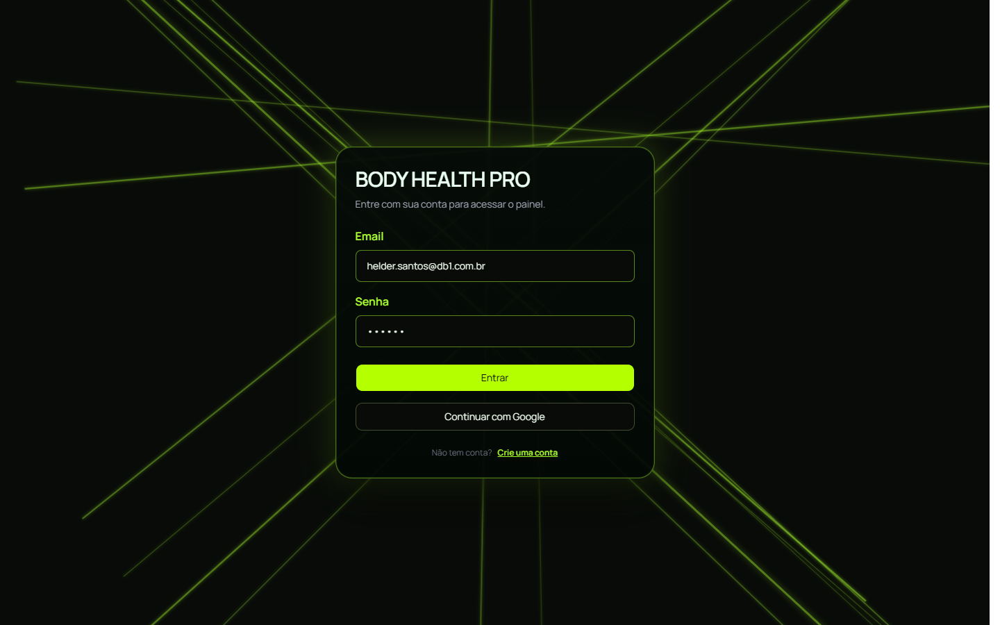
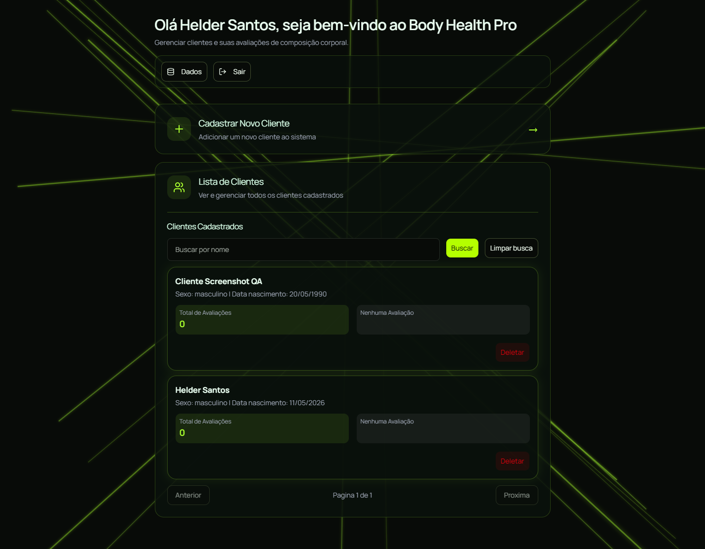
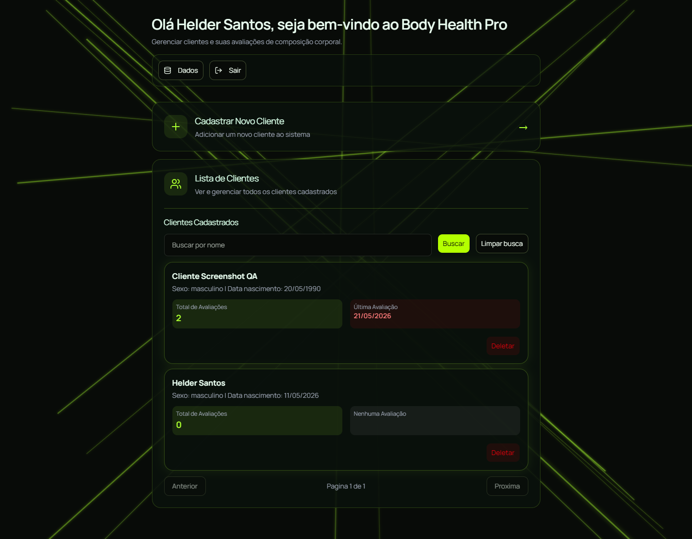
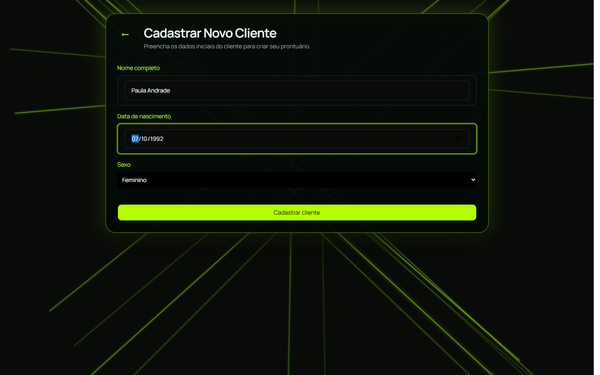
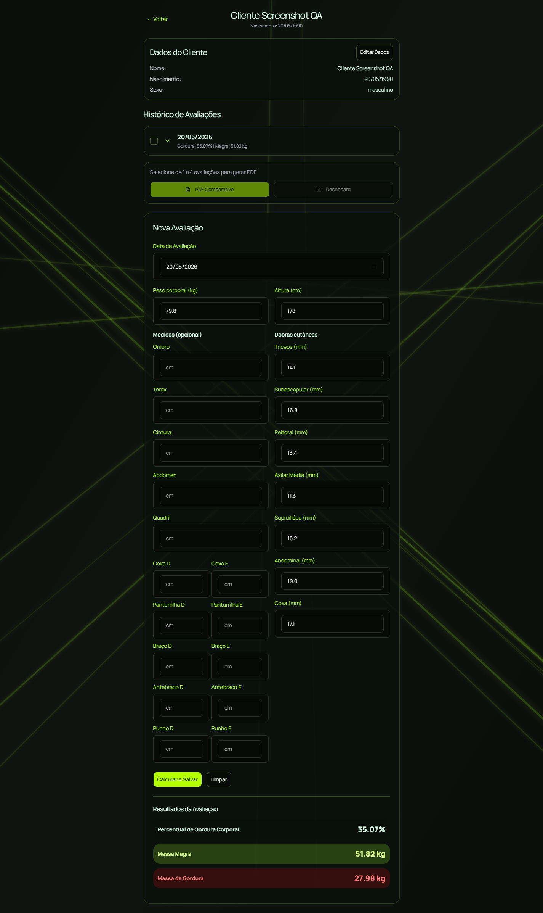
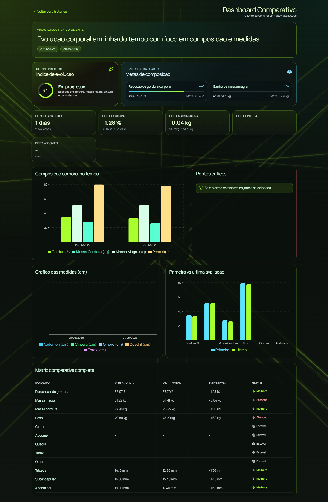

# Body Health Pro

Plataforma para gestao de composicao corporal com foco em profissionais de saude e academias.

## Visao Geral

O projeto esta organizado em monorepo e inclui:

- app administrativo para cadastro de clientes e lancamento de avaliacoes
- app do cliente para acompanhamento da propria evolucao
- pacotes compartilhados de dominio, validacao e acesso a dados
- integracao com Supabase para autenticacao, RLS e persistencia

## Funcionalidades Principais

- login com autenticacao
- cadastro e listagem de clientes
- tela de avaliacao corporal com calculo de gordura, massa magra e massa gorda
- dashboard comparativo entre avaliacoes

## Capturas de Tela (Playwright MCP)

As imagens abaixo foram geradas com viewport 1440x900 e full page, com tratamento visual para esconder toasts temporarios e aguardar fim de loaders.

### Login

### Dashboard Admin com tabela de clientes

### Home apos 2 avaliacoes (cards atualizados)

Evidencia visual do cliente com indicadores atualizados nos cards/lista:

- Total de Avaliacoes: 2
- Ultima Avaliacao: 21/05/2026

### Cadastro de cliente

### Avaliacao do cliente

### Dashboard comparativo

## Observacao de Ambiente

Durante a automacao, foram selecionadas duas avaliacoes salvas no historico do cliente e o dashboard comparativo foi carregado com dados reais. O screenshot em `./docs/images/dashboard-comparativo.png` foi atualizado com este estado preenchido.
